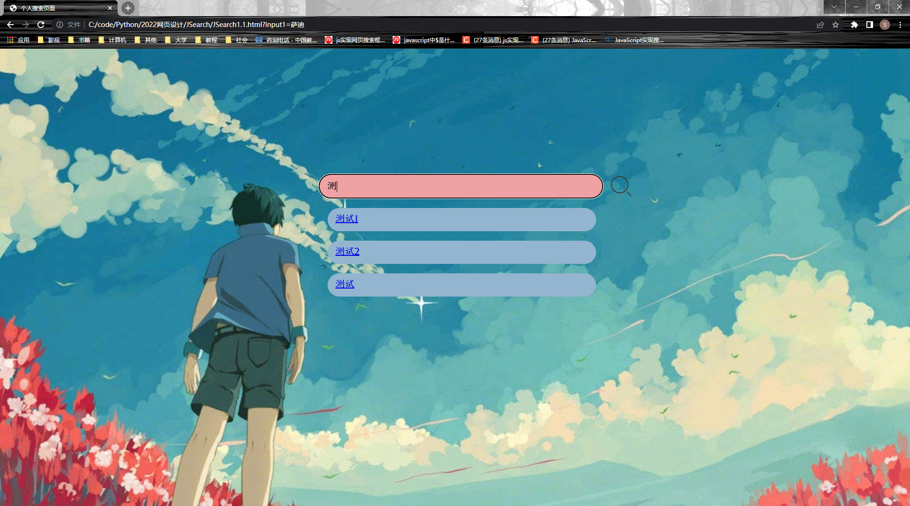

# The 12th week of learning JS

## [Learning videos](https://www.bilibili.com/video/BV1p4411Q7pT?p=1)

### 1.1Introduction to Ajax data interaction

- AJAX = Asynchronous JavaScript and XML
- None Refresh Data is asynchronously fetched from the server

### 1.2Setting up the Server Environment

- Install WAMP

### 1.3Interaction processes and issues

- `ajax(url,Func_succeed,Func_fail)`
- Relevant issues
  - Cache
    - `a.txt?t='+Math.random()`
  - All return values are strings
    - `JSON.parse(data)`
    - Compatibility:`<meta http-equiv="X-UA-Compatible" content="ie=edge">`
  - Unidentifiable Chinese code
    - Use the correct encoding format
  - The request file is independent of the suffix name

#### Outcome

```
<!DOCTYPE html>
<html lang="en">
    <head>
        <meta charset="UTF-8">
        <title>Document</title>
        <script type="text/javascript">
            var httpRequest;
            function checkUsername() {
                if(window.XMLHttpRequest) {
                    //在IE6以上的版本以及其他内核的浏览器(Mozilla)等
                    httpRequest = new XMLHttpRequest();
                }else if(window.ActiveXObject) {
                    //在IE6以下的版本
                    httpRequest = new ActiveXObject();
                }
                //创建http请求
                httpRequest.open("POST", "a.txt", true);
                //因为我使用的是post方式，所以需要设置消息头
                httpRequest.setRequestHeader("Content-type", "application/x-www-form-urlencoded");
                //指定回调函数
                httpRequest.onreadystatechange = response22;
                //得到文本框的数据
                var name = document.getElementById("username").value;
                //发送http请求，把要检测的用户名传递进去
                httpRequest.send("username=" + name);
            }
            function response22() {
                //判断请求状态码是否是4【数据接收完成】
                if(httpRequest.readyState==4) {
                    //再判断状态码是否为200【200是成功的】
                    if(httpRequest.status==200) {
                        //得到服务端返回的文本数据
                        var text = httpRequest.responseText;
                        //把服务端返回的数据写在div上
                        var div = document.getElementById("result");
                        div.innerText = text;
                    }
                }
            }
        </script>
    </head>
    <body>
        <input type="text" id="username">
        <input type="button" onclick="checkUsername()" value="检测用户名是否合法">
        <div id="result"></div>
    </body>
</html>
```

## 一些尝试

```JavaScript
<html>
<head>
    <meta charset="UTF-8">
    <title>个人搜索页面</title>
    <style>
        @font-face {
            font-family:myFont;
            src: url(FZYanZQKSJF.TTF);
        }
        .background{
            position: fixed;
            width: 100%;
            height: 100%;
            left: 0;
            top: 0;
            font-family:myFont;
        }
        .searchbox{
            box-sizing: border-box;
            min-height: 40px;
            max-height: 52px;
            min-width: 580px;
            max-width: 596px;
            white-space: nowrap;
            position: absolute;
            top: 25%;
        }
        .searchinput{
            width: 600px;
            height: 52px;
            border-radius:30px ;
            margin: auto;
            position: relative;
            left: 35%;
            font-size:20px;
            background-color:#eea2a4;
            padding: 12px 10px 12px 16px;
            font-family:myFont;
        }
        .options{
            height: 25%;
            width: 100%;
        }
        .mainbody{
            background-image: url('Jsearch.png');
            background-size:100%;
            background-attachment: fixed;
        }
        .searchbutton{
            position: relative;
            top:20px;
            left: 680px;
            height: 52px;
            width: 52px;
        }
        .searchlist{
            position: relative;
            left: 36%;
            top:0px;
        }
        p{
            background-color:#93b5cf;
            height: 25px;
            width:540px;
            border-radius:30px ;
            font-size:20px;
            padding: 12px 10px 12px 16px;
        }
    </style>
    <script type="text/javascript">
        window.onload=function(){
            var form = document.getElementById("form");
            var input1 = document.forms["form"]["input1"];
            var wrap = document.getElementById("wrap");
            var btn=document.getElementById("btn");
            var count=0;
            var history = document.getElementById('history');
            var arr1 = [];//数组里面的元素就是我希望在输入宽输入某个字符后在下方出现的搜索字符。
            var arr2 = [];//这个数组是为了装入经过筛选和匹配符合要求的arr1中的元素。
            input1.oninput = function() {
                var val = input1.value;//获取当前输入框的值。
                arr2 = [];//使得每次输入框值变化后数组arr2为空。否则wrap中的元素会越来越多。
                var p1 = wrap.getElementsByTagName("p");
                for (var k = p1.length-1; k >= 0; k--) {
                    p1[k].remove();
                };

                //装入筛选后字段
                for (var i = 0, max = arr1.length;i<max; i++) {     //这样做好像可以减少调用负担
                    if (arr1[i].indexOf(val) > -1 ) {
                        arr2.push(arr1[i]);
                    }   
                }
                //创建元素的循环。在每个创建的元素内添加arr2数组中的字符串。
                for (var j = 0; j < arr2.length; j++) {
                    var p = document.createElement("p");
                    var a = document.createElement("a");
                        a.innerText = arr2[j];
                        a.setAttribute("href","https://cn.bing.com/search?q="+arr2[j]);
                        p.appendChild(a);
                        wrap.appendChild(p);
                }
            }
            btn.onclick=function(){
                var val = input1.value;//获取当前输入框的值。
                if(val=='')alert("你还什么都没有输入!")
                else {
                    arr1.unshift(val);
                    count++;
                    console.log(count);
                    if(count>3)arr1.splice(4,1);
                    var jump = confirm("这里没有你要的信息,请前往谷歌搜索");
                    if(jump) parent.location='https://www.google.com.hk/search?q='+val;
                }
                for (var i = 1, max = arr1.length;i<max; i++) {
                    if (arr1[i]==val) {
                        arr1.splice(i,1);
                    }   
                }
            }
            function search(){
                var val = input1.value;//获取当前输入框的值。
                if(val=='')alert("你还什么都没有输入!")
                else {
                    arr1.unshift(val);
                    count++;
                    console.log(count);
                    if(count>3)arr1.splice(4,1);
                    var jump = confirm("这里没有你要的信息,请前往谷歌搜索");
                    if(jump) parent.location='https://www.google.com.hk/search?q='+val;
                }
                for (var i = 1, max = arr1.length;i<max; i++) {
                    if (arr1[i]==val) {
                        arr1.splice(i,1);
                    }   
                }
            }
        }
    </script>
</head>
<body class="mainbody" >
    <div class="background">
        <div id="history" class="options"></div>
        <div id="searchbox">
            <form id="form" name="form">
                <div>
                    <input type="text" class="searchinput" name="input1">
                    
                </div>
                <div id="wrap" class="searchlist"></div>
            </form>
        </div>   
    </div>   
</body>
</html>
```

### 代码分析

1. 较之上周界面已经好看了很多
2. 现在遇到的问题是<form>回车事件会自动刷新页面,这很不好
3. 现在想到两个办法:要不然不用<form>,或者重写其回车事件
4. 几乎所有期望功能已经实现后续增加一些润色
5. 下载矢量图与字体,请在Download页面下找`F&S.zip`


