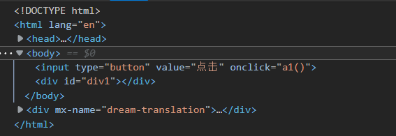
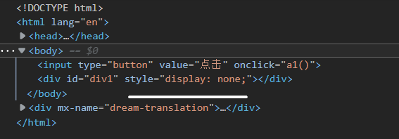

# The second week of learning JS

##  [Learning videos](https://www.bilibili.com/video/BV1J4411Q7Fx?p=1)

### 1.6 Website theme change

#### Demand

1. click different buttons to change to different themes.
2. example:
   1. click "day":bgcolor change to green,font--
   2. click"night":bgcolor change to black,font++

#### Steps

1. create one page,two buttons,one div
2. click button ,trigger event
3. change theme

#### Outcome

```html
<!DOCTYPE html>
<html>
<head>
<meta charset="utf-8">
<title>js-learning</title>
    <style>
        #div1{
            width:200px;
            height:200px;
            background:red;
            font-size: 12px;
            }
    </style>
    <script>
        function dayTheme(){
            document.body.style.background='green';
            document.getElementById('div1').style.fontSize='12px';
        }
        function nightTheme(){
            document.body.style.background='black';
            document.getElementById('div1').style.fontSize='20px';
        }
    </script>
</head>
<body>
    <button type="button" onclick="dayTheme()">day</button>
    <button type="button" onclick="nightTheme()">night</button>
    <div id="div1">When I was young, I had freedom, but I didn't know what it meant.
I had time, but I didn't realize how valuable it was. I had love, but I never felt it.
After decades of time, </div>
</body>
</html>
```

#### Program analysis:

1. Further simplification:

```
	<style>
        #div1{
            width:200px;
            height:200px;
            background:red;
            font-size: 12px;
            }
    </style>
    <script>
        function dayTheme(){
            document.body.style.background='green';
            document.getElementById('div1').style.fontSize='12px';
        }
        function nightTheme(){
            document.body.style.background='black';
            document.getElementById('div1').style.fontSize='20px';
        }	
      </script>
-----------------------------------------------------------------------
	<style>
	
        #div1{width:200px;height:200px;background:red;font-size: 12px;}
        .day{background='green';fontSize='12px';}
        .night{background='black';fontSize='20px';}
        
    </style>
    <script>
    
        function dayTheme(){document.body.clsssName='day';}
        function nightTheme(){document.body.className='night';}	
        
    </script>
```

2. More complex steps, clearer logic. 
3. Pay attention to the use of CSS.
   1. The style of CSS can simplify and package JS.
   2. But the keywords of CSS and JS have some differences, be careful when using it.

### 1.7 Function parameter

#### Demand

1. change color by three buttons

#### Steps

1. But seeing three nearly identical button expressions while listening and programming reminded me of the simplicity I've been emphasizing in these lectures  .
2. So I did the simplified,and the code is just like the final result . 

#### Outcome

```
<!DOCTYPE html>
<html>
<head>
<meta charset="utf-8">
<title>js-learning</title>
    <style>
        #div1{
            width:200px;
            height:200px;
            background:red;
            }
    </style>
    <script>
        function toColor(var_color){
            document.getElementById('div1').style.background=var_color;
        }
    </script>
</head>
<body>
    <button type="button" onclick="toColor('Red')">Red</button>
    <button type="button" onclick="toColor('Blue')">Blue</button>
    <button type="button" onclick="toColor('Green')">Green</button>
    <div id="div1"> </div>
</body>
</html>
```

#### Program analysis:

1. The paraments of JS can be easily used ,that we don't need to define its data type or initialize.
2. And pay attention to the name of parament should be significant and recognizable.

## Reflecting Questions

### Why didn't the first click work?

```
<!DOCTYPE html>
<html lang="en">
<head>
    <meta charset="UTF-8">
    <meta http-equiv="X-UA-Compatible" content="IE=edge">
    <meta name="viewport" content="width=device-width, initial-scale=1.0">
    <title>Document</title>
    <style>
        #div1 {
            width: 200px;
            height: 200px;
            background-color: blue;
            display: none;
        }
    </style>
    <script>
        function a1(){
            var od=document.getElementById('div1');
            if(od.style.display=='none'){od.style.display='block';}
            else{od.style.display='none';}
        }
    </script>
</head>
<body>
    <input type="button" value="点击" onclick='a1()'>
    <div id='div1'></div>
</body>
</html>
```

#### Program analysis:

1. This can be found by examining the elements,after the first click,the style of div wasn't been loaded.

2. This is because some JavaScript code in a web page often needs to be executed after the document is loaded, otherwise it may not be able to get objects until the document is loaded at the first click

   before click

      after click

#### Solution

1. Put the script at the bottom of the page, and when you run the script, you make sure that the object you want to manipulate has been loaded.

2. Use "window.onload"

   ```
   window.onload = function(){
   	a();
   }
   ```

3. document.style.att:You can only fetch style attributes defined on the element tag or written by JS, not CSS attributes.

