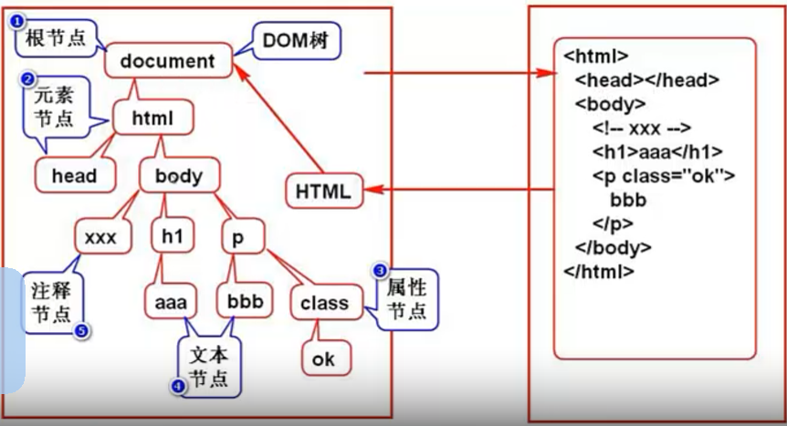

# The tenth week of learning JS

## [Learning videos](https://www.bilibili.com/video/BV1J4411Q7Fx?p=1)

### 1.30JS component

#### Main content 

1. ECMAScript(interpreter)

2. DOM(Document Object Model)

   

1. BOM(Browser Object Model)
   
   1. Operating the browser window: Check the browser version and obtain the URL value

### 1.31DOM common operations: add, delete, modify, search

- Get the parent node:`.parentNode`
- Get child nodes:`.children`
- Head and tail child nodes:`.firstchild   .lastchild`
- Get sibling nodes:`.nextElementSibiling   .previousElementSinling` 
- Logic or:` || `

1. createElement：

    ```
    var elem = document.createElement("div");  
    elem.id = 'haorooms';  
    elem.style = 'color: red';  
    elem.innerHTML = '我是新创建的haorooms测试节点';  
    document.body.appendChild(elem); 
    ```
    
2. The element created by createElement is not part of the Document object; it is simply created and not added to the HTML document; it is added to the HTML document with a call like appendChild or insertBefore.

2. createTextNode：

    ```
    var node = document.createTextNode("我是文本节点");  
    document.body.appendChild(node);  
    ```

3. cloneNode：

    ```
    node.cloneNode(true/false) ，它接收一个bool参数，用来表示是否复制子元素。
    var from = document.getElementById("test");  
    var clone = from.cloneNode(true);  
    clone.id = "test2";  
    document.body.appendChild(clone);  
    ```

4. removeChild:
   1. removeChild:Used to delete the specified child node and return the child node, syntax:```var deletedChild = parent.removeChild(node);  ```

   2. deletedChild

      1. A reference to the deleted node that still exists in memory and is ready for the next step. In addition, an error is reported if the deleted node is not a child node. Nodes are usually deleted in this way:

      ```
       function removeNode(node)  {  
           if(!node) return;  
           if(node.parentNode) node.parentNode.removeChild(node);  
       }  
      ```

5. replaceChild
    1. replaceChild用于将一个节点替换另一个节点，语法：

        ```
        parent.replaceChild(newChild, oldChild);
        ```

### 1.32Manipulate elements and attributes

#### Two ways to manipulate elements :

1. Form elements:`input.value`
2. Non-form elements:`innerHTML`

Two ways to manipulate attributes :

1. Use ` .`  or ` []`
2. `getAttribute/setAttribute` need to use them in pairs,and custom properties can be obtained

### 1.33Move up and down

#### Outcome

```html
<!DOCTYPE html>
<html lang="en" xmlns="http://www.w3.org/1999/xhtml">
<head>
    <meta charset="utf-8">
    <title></title>
    <script>
        window.onload = function () {
            var oUl = document.getElementById('ul1');
            var aPrevBtn = oUl.getElementsByClassName('prev');
            //上移
            var aNextBtn = oUl.getElementsByClassName('next');
            for (var i = 0; i < aPrevBtn.length; i++) {
                aPrevBtn[i].onclick = function () {
                    var obj = this.parentNode;
                    if (obj == oUl.children[0]) {
                        alert('亲，到头了');
                        return;
                    }

                    var oPrev = obj.previousSibling;
                    oUl.insertBefore(obj, oPrev);
                }
            }
            for (var i = 0; i < aNextBtn.length; i++) {
                aNextBtn[i].onclick = function () {
                    var obj = this.parentNode;
                    if (obj == oUl.children[oUl.children.length-1]) {
                        alert('亲，到底了');
                        return;
                    }
                    var oNext = obj.nextSibling;
                    var oNext2 = oNext.nextSibling;
                    oUl.insertBefore(obj, oNext2);
                }
            }
        }
     </script>
</head>
<body>
    <ul id="ul1">
        <li>
            <span>0.苹果春季发布会即将召开，但发布硬件新品几率不大</span>
            <a href="javascript:;" class="prev">上移</a>
            <a href="javascript:;" class="next">下移</a>
        </li>
        <li>
            <span> l .谷歌投资房地产：XXXXXXXXXXXXXXXX</span>
            <a href="javascript:;" class="prev">上移</a>
            <a href="javascript:;" class="next">下移</a>
        </li>
        <li>
            <span>2.XXXXXXXXXXXXXXXXXXXXXXXXXXXXXXXXXX</span>
            <a href="javascript:;" class="prev">上移</a>
            <a href="javascript:;" class="next">下移</a>
        </li>
        <li>
            <span> 3 .YYYYYYYYYYYYYYYYYYYYYYYYYYYYY</span>
            <a href="javascript:;" class="prev">上移</a>
            <a href="javascript:;" class="next">下移</a>
        </li>
    </ul>
</body>
</html>

```

Program analysis:

1. It became clear that the business logic was not as straightforward as before, and that we needed to analyze its execution to see which components were being acted upon at each step  .
2. The specific functions were already mentioned in the last lecture, so I won't go into more details here.

